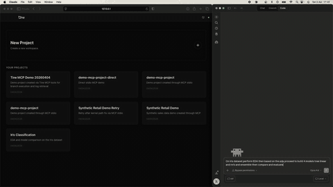

# Tine

[](https://pypi.org/project/tine/)
[](https://pypi.org/project/tine/)
[](https://github.com/tinelabs/tine/actions/workflows/ci.yml)
[](https://github.com/tinelabs/tine/blob/main/LICENSE)
[](https://pypi.org/project/tine/)
[](https://github.com/tinelabs/tine/releases)

A branching notebook runtime for AI and humans.

Tine is a local-first execution engine where notebooks branch like code. Run work in the browser, connect an agent through MCP, and keep both attached to the same fast local runtime.

<p align="center">
  <strong>Built for agent workflows</strong> · <strong>MCP-native</strong> · <strong>Written in Rust</strong>
</p>

<p align="center">
  
</p>

Tine gives AI agents a safe place to explore multiple paths in parallel while you keep the browser view over the same local state, logs, and results.


## What Tine is

Tine is built around a tree-native notebook model:

- an **experiment** is the main working unit
- an experiment contains **branches**
- branches contain **cells**

Each experiment owns its own execution environment and kernel. Execution happens against branches and cells inside that experiment, which makes it practical to explore multiple paths without collapsing everything into one linear notebook.

In practice, that gives Tine a few important properties:

- local-first execution
- branch-aware notebook workflows
- reproducible runtime ownership
- one backend shared by the UI and MCP

## Product shape

Tine has a simple surface model:

- **Web UI** for people
- **Local Rust server** as the canonical backend
- **Python MCP layer** for agent integrations

The UI and MCP are adapters over the same local system rather than separate runtimes.

## Quick start

The release-oriented install path is:

```bash
pip install tine
```

Tine requires Python 3.10 or newer. If your system `python` points to an older interpreter, install with a newer one explicitly, for example `python3.11 -m pip install tine`.

Then start the local server for your workspace:

```bash
tine serve --workspace . --bind 127.0.0.1:9473 --open
```

If you want to sanity-check the install first:

```bash
tine doctor
```

Open the app at:

```text
http://127.0.0.1:9473
```

That install gives you:

- `tine` as the public wrapper entrypoint
- `tine mcp ...` for MCP config and stdio adapter commands
- `tine-mcp` as a compatibility alias for the MCP adapter

On first use, the wrapper resolves a matching Tine engine binary for your OS and architecture.

Supported release targets today:

| OS | Architectures |
| --- | --- |
| macOS | Apple Silicon, Intel |
| Linux | x86_64, arm64 |
| Windows | x86_64 |

The server is the canonical local backend. Both the web UI and MCP connect to that same API.

If you do not want the browser to open automatically:

```bash
tine serve --workspace . --bind 127.0.0.1:9473
```

## MCP setup

Tine supports agent workflows through MCP.

The intended flow is:

1. start the local Tine server
2. configure a host to launch `tine mcp serve`
3. let the MCP adapter talk to the same local API used by the UI

The standard MCP stdio command is:

```bash
tine mcp serve --api-url http://127.0.0.1:9473
```

`tine-mcp --api-url http://127.0.0.1:9473` is also supported, but `tine mcp serve` is the preferred public form.

### MCP config generation

Generate an MCP config document for a supported host:

```bash
tine mcp print-config --host vscode
```

Supported hosts:

- `vscode`
- `cursor`
- `claude`
- `generic`

If your Tine server uses a non-default API URL, include it explicitly:

```bash
tine mcp print-config --host vscode --api-url http://127.0.0.1:9473
```

Example VS Code config output:

```json
{
  "servers": {
    "tine": {
      "type": "stdio",
      "command": "tine",
      "args": ["mcp", "serve", "--api-url", "http://127.0.0.1:9473"]
    }
  }
}
```

Example Claude Desktop config output:

```json
{
  "mcpServers": {
    "tine": {
      "command": "tine",
      "args": ["mcp", "serve", "--api-url", "http://127.0.0.1:9473"]
    }
  }
}
```

### MCP config registration

To write the generated config directly into the standard host config location:

```bash
tine mcp register --host vscode --api-url http://127.0.0.1:9473
```

Equivalent examples:

```bash
tine mcp register --host cursor --api-url http://127.0.0.1:9473
tine mcp register --host claude --api-url http://127.0.0.1:9473
```

Default config targets are resolved per OS:

| Host | macOS | Linux | Windows |
| --- | --- | --- | --- |
| VS Code | `~/Library/Application Support/Code/User/mcp.json` | `~/.config/Code/User/mcp.json` | `%APPDATA%/Code/User/mcp.json` |
| Cursor | `~/Library/Application Support/Cursor/User/mcp.json` | `~/.config/Cursor/User/mcp.json` | `%APPDATA%/Cursor/User/mcp.json` |
| Claude | `~/Library/Application Support/Claude/claude_desktop_config.json` | `~/.config/Claude/claude_desktop_config.json` | `%APPDATA%/Claude/claude_desktop_config.json` |

If you prefer to manage the file yourself, print the config and copy it into your host config manually instead of using `register`.

## Common local setup

For the most common local setup:

```bash
pip install tine
tine serve --workspace . --bind 127.0.0.1:9473 --open
tine mcp register --host vscode --api-url http://127.0.0.1:9473
```

That gives you:

- the **web UI** talking to the local API
- the **MCP adapter** talking to the same local API
- one local Rust backend shared by both

## Development from source

If you are working inside this repository rather than using the release package, the development startup path is:

```bash
cargo run -p tine-cli -- serve --workspace . --bind 127.0.0.1:9473 --open
```

That path is for repo development. For fresh user onboarding and release usage, prefer `pip install tine` followed by `tine serve`.

## Repository guide

If you are navigating the repo, these are the most relevant top-level areas:

- `ui/` for the browser UI
- `crates/tine-server/` for the local HTTP and WebSocket server
- `crates/tine-cli/` for the local launcher and operator commands
- `packaging/python/` for the Python wrapper, packaging, and MCP entrypoints

## Contributing

Contributions from both humans and AI agents are welcome.

For contribution rules, issue focus areas, validation guidance, and the current priority list, see [CONTRIBUTING.md](CONTRIBUTING.md).

## Acknowledgements

Tine is grateful to the `ipykernel` and Jupyter communities. Their work helped establish the notebook and kernel patterns that make interactive computing and tool-driven workflows possible.


